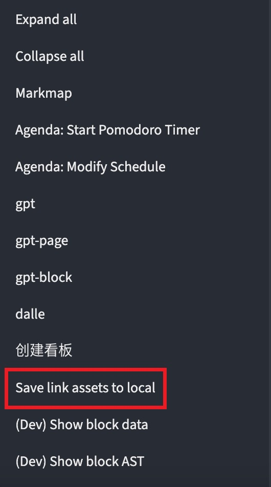

English | [中文](./README_CN.md)

- # logseq-link-to-local
	- Convert network assets into local assets.
- ## Features
	- Image
	- Audio
	- Video
	- To be supplemented ...
- ## Usage
	- Enter slash command: `/Save link assets to local`
		- 
	- Block menu item: `Save link assets to local`
		- 
	- Page menu item: `Save all link assets to local`
		- 
- ## Demo
	- 
	- http://img.ypll.xyz/logseq/logseq-link-to-local.mp4
- ## License
	- [MIT](https://choosealicense.com/licenses/mit/)
