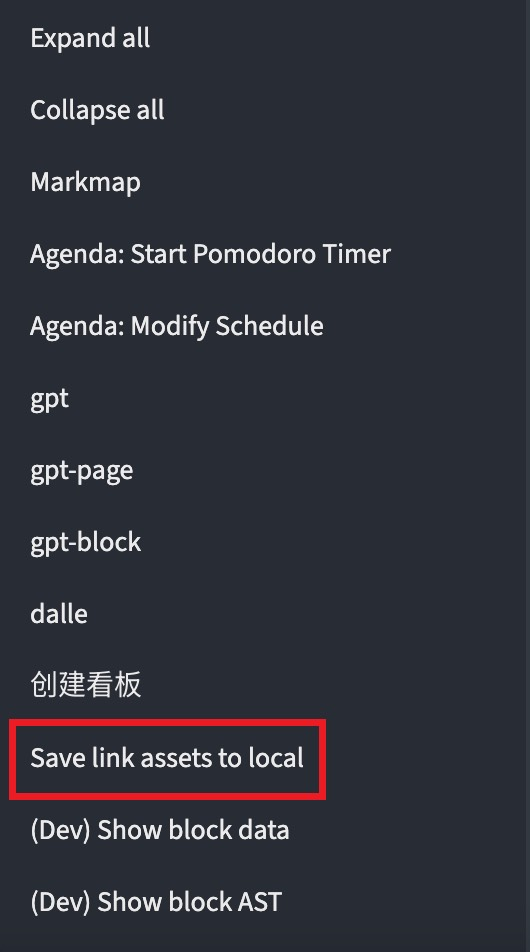
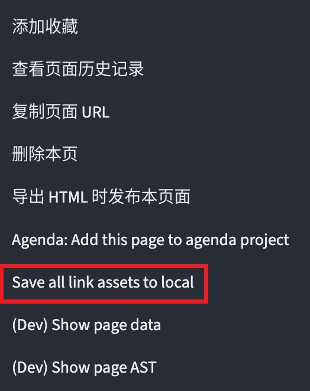

中文 | [English](./README.md)
- # logseq-link-to-local
	- 将网络资源转换成本地资源
- ## 功能
	- Image
	- Audio
	- Video
	- 待补充...
- ## 用法
	- 输入斜杠命令: `/Save link assets to local`
		- 
	- 点击块级菜单项: `Save link assets to local`
		- 
	- 点击页面菜单项: `Save all link assets to local`
		- 
- ## 演示
	- 
	- http://img.ypll.xyz/logseq/logseq-link-to-local.mp4
- ## 许可证
	- [MIT](https://choosealicense.com/licenses/mit/)
